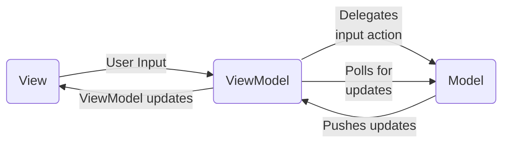

## Introduction

```mermaid
graph LR

A(View)
B(ViewModel)
C(Model)
A --User Input-->  B
B --ViewModel updates--> A
B --Delegates<br/>input action--> C
B --Polls for<br/>updates--> C
C --Pushes updates--> B
  
```
