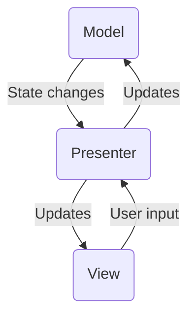
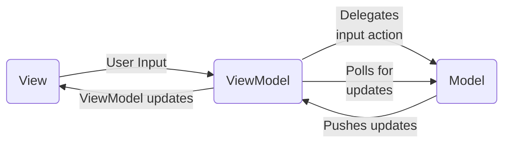

## Introduction

### Architectural pattern

#### MVP

```mermaid
graph TD
M(Model)
V(View)
P(Presenter)

V --User input--> P
P --Updates--> V

P --Updates--> M
M --State changes-->P

```

#### MVVM

```mermaid
graph LR

A(View)
B(ViewModel)
C(Model)
A --User Input-->  B
B --ViewModel updates--> A
B --Delegates<br/>input action--> C
B --Polls for<br/>updates--> C
C --Pushes updates--> B
  
```
